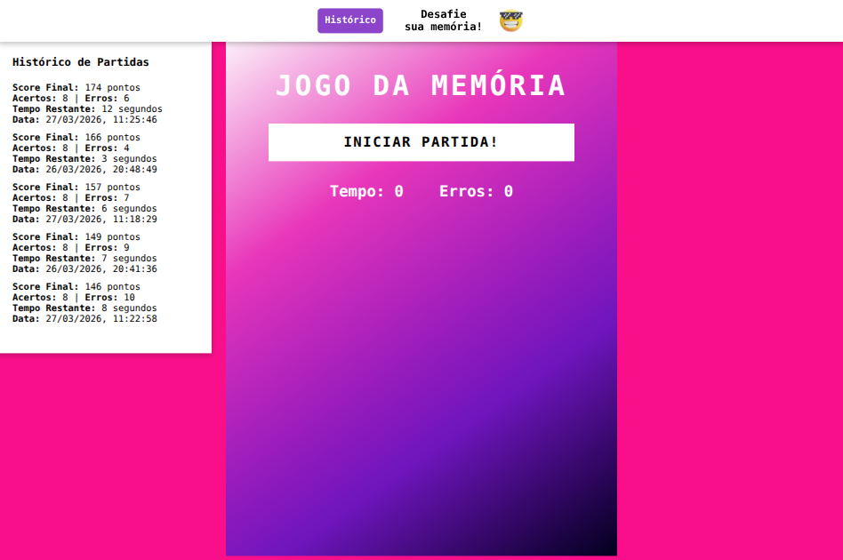
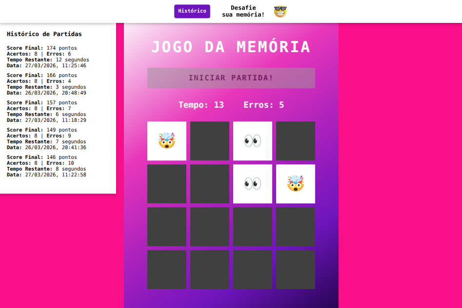

# 🃏 Jogo da Memória com Temporizador ⏳

Este é um jogo da memória simples desenvolvido em **HTML, CSS e JavaScript**. O objetivo é encontrar os pares de emojis antes que o tempo acabe! 🚀

## Jogue agora

Para testar o jogo basta [clicar aqui!](https://leandrodevlab.github.io/jogo-da-memoria/)

## 📸 Preview

<table>
      <tr>
         <td>
   
         </td>
         <td>
   
         </td>
      </tr>
</table>

## 📌 Funcionalidades

- 🔀 **Embaralhamento automático** das cartas no início do jogo.
- 🎯 **Verificação de pares** ao clicar em duas cartas.
- ❌ **Contador de erros**, mostrando quantas vezes o jogador errou.
- ⏳ **Temporizador regressivo** de 30 segundos para completar o jogo.
- ⚠️ **Bloqueio de jogadas** até que o tempo seja iniciado.
- 🏆 **Mensagem de vitória** ao encontrar todos os pares antes do tempo acabar.

## 🎮 Como Jogar

1. Clique no botão **"INICIAR PARTIDA!"** para começar a contagem regressiva.
2. Caso deseje reiniciar o jogo antes do tempo acabar clique no botão **"RESETAR O JOGO"**
3. Clique nas cartas para revelar os emojis.
4. Tente encontrar os pares iguais antes que o tempo acabe.
5. Se todas as cartas forem combinadas antes do tempo acabar, **você vence!** 🏆
6. Se o tempo zerar antes de completar o jogo, **você perde** e deve reiniciar.
7. Caso estejam competindo com outro jogador vence quem tiver o maior número de acertos, **no caso de empates** (quem tiver o menor _número de erros_ **vence**)

## 🛠️ Tecnologias Utilizadas

- **HTML** → Estrutura da página.
- **CSS** → Estilização dos elementos.
- **JavaScript** → Lógica do jogo e controle do tempo.

## 📂 Estrutura do Projeto

```
📁 jogo-da-memoria
┣ 📂 src
┃ ┣ 📂 audios
┃ ┣ 📂 img
┃ ┣ 📂 scripts
┃ ┣ ┗ 📜 engine.js
┃ ┗ 📂 styles
┃   ┣ 📜 main.css
┃   ┗ 📜 reset.css
┣ 📜 index.html
┗ 📜 README.md
```

## 🆕 Últimas atualizações

- 💾 **Armazenamento de histórico de partidas com `localStorage`**
  - Agora o jogo salva informações como:
    - quantidade de acertos
    - quantidade de erros
    - resultado da partida
    - renderiza histórico de ranking e estatísticas

- 🖱️ **Correção de botões clicáveis**
  - Botão de iniciar não pode mais ser clicado várias vezes indevidamente
  - Controle correto de estado (ativado/desativado)

- 🔒 **Melhoria na experiência do usuário (UX)**
  - Bloqueio de cliques enquanto duas cartas estão sendo comparadas
  - Evita bugs e jogadas inválidas
  - Interação mais fluida e consistente

- 📱 **Responsividade (mobile)**
  - Ajuste de responsividade para mobile com ajustes finos para telas de:
    - até 500px;
    - até 412px;
    - e até 350px.

---

## 🚀 Como Executar o Projeto

1. Baixe ou clone este repositório:
   ```sh
   git clone https://github.com/leandrodevlab/jogo-da-memoria.git
   ```
2. Abra o arquivo `index.html` em um navegador.
3. Divirta-se jogando! 🎉

## 👨‍💻 Autor

Desenvolvido por **Leandro Sávio**  
🚀 Desenvolvedor Fullstack

---

## 📜 Licença

Este projeto é de código aberto e pode ser utilizado para estudos e melhorias! 😊
